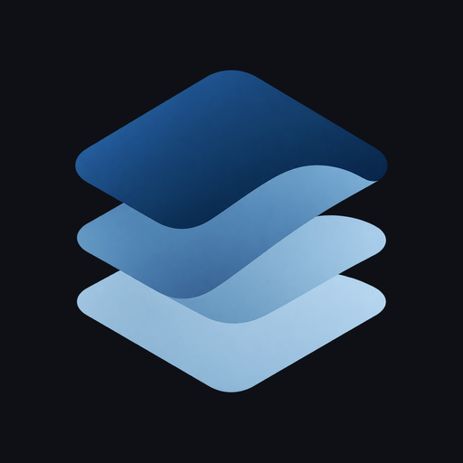
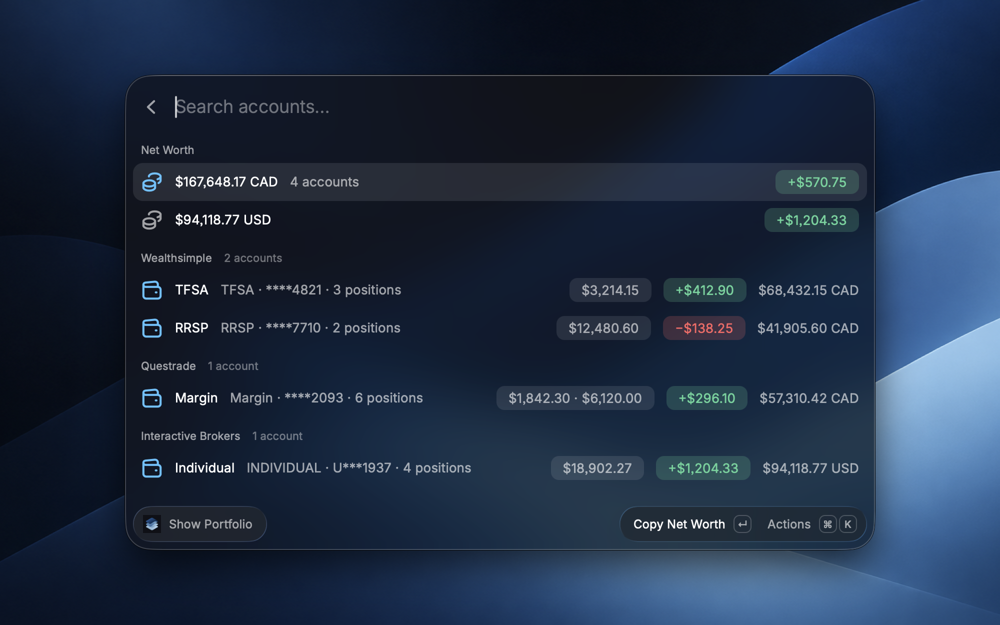
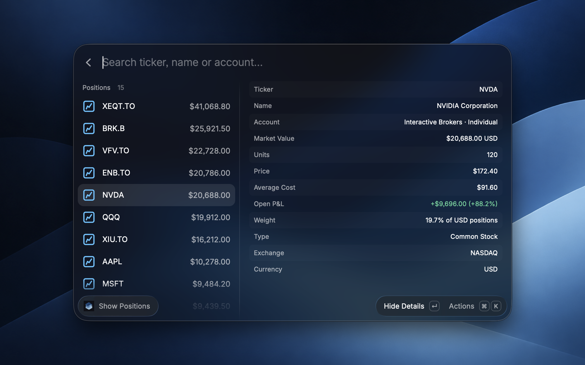
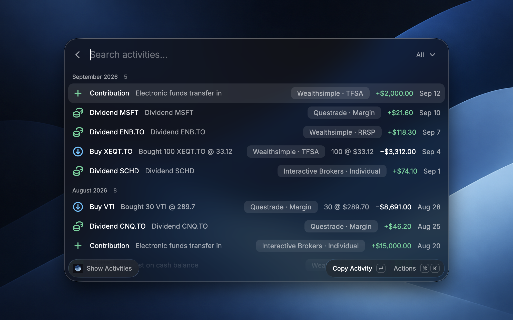
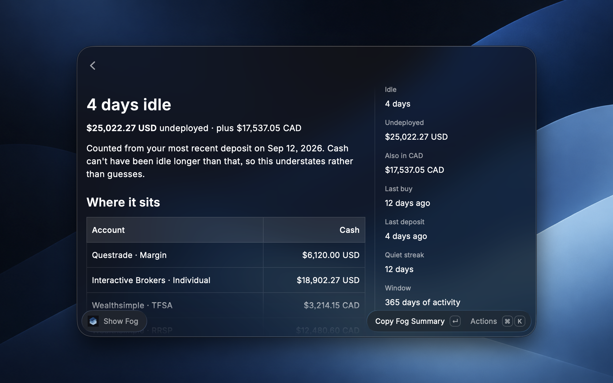

<p align="center"></p>

# Folio

**Your portfolio in Raycast.** A keyboard-first, read-only view of every brokerage account you've connected through [SnapTrade](https://snaptrade.com): net worth, holdings, activities, and *Fog*, the cash you've left idle.

Works with Wealthsimple, Questrade, Interactive Brokers and every other brokerage SnapTrade supports. MIT licensed. Read-only by design: Folio cannot place trades or move money.



<details>
<summary>More screenshots</summary>







</details>

## Install

Until the Raycast Store listing is live, install from source. You need macOS, [Raycast](https://raycast.com) and Node 20+.

```bash
git clone https://github.com/ShayanAbedi/folio && cd folio/extension && npm install && npx ray develop
```

Once it has built you can stop it with Ctrl+C; Folio stays installed under Raycast's "Extension Development" section. To update later, `git pull` and run the same command again.

You'll also need a [SnapTrade account](https://dashboard.snaptrade.com/signup?personal=) with at least one brokerage connected. Folio's **Connect Brokerage** command can open the connection portal for you after you sign in.

## Use

1. Run **Sign in with SnapTrade**. Your browser opens SnapTrade's consent page; approve read-only access and Raycast picks it up from there. Nothing to paste.
2. Run **Show Portfolio**.

| Command | What it shows |
| --- | --- |
| Show Portfolio | Net worth per currency, accounts by institution, holdings per account |
| Show Positions | Every position across accounts, searchable. `Show Positions AAPL` jumps straight to a ticker |
| Show Activities | All · Trades · Dividends · Deposits for the last 365 days |
| Show Fog | Idle cash: how much is sitting undeployed and for how long |
| Connect Brokerage | Link another brokerage, or repair a disabled connection |
| Menu Bar Portfolio | Net worth in the menu bar, with per-account totals and Fog |
| Sign in with SnapTrade | Start or end your session |

Everywhere: **⌘⇧P** hides every balance (privacy mode), **⌘R** refreshes, **⌘I** toggles position details.

## What Fog means

Fog is cash that isn't doing anything. The amount is your cash balance across accounts. The idle days are counted from the later of your last buy and your last deposit. If neither happened in the last 365 days, Folio says "365+" rather than guessing. It understates on purpose.

## Privacy and security

- **Read-only.** SnapTrade OAuth sessions can't trade. Folio only ever reads accounts, balances, positions and activities.
- **Your data goes straight from Raycast to SnapTrade.** Nothing about your portfolio passes through any other server.
- **Tokens stay on your Mac**, stored by Raycast's encrypted OAuth store. Signing out revokes them at SnapTrade and deletes them locally.
- **The one piece of server code** is a small, open-source Cloudflare Worker in [`auth-worker/`](auth-worker/) that turns your one-time sign-in code into tokens. It holds no user data and keeps no logs of tokens. Its threat model is written up in [SECURITY.md](SECURITY.md).
- **Demo mode** (the "Use bundled fixture data" preference) renders invented sample accounts without any network access, if you want to try Folio before signing in.

Found a security problem? See [SECURITY.md](SECURITY.md).

## Contributing

Bug reports and pull requests are welcome. Setup, tests, and how to run your own auth worker are in [CONTRIBUTING.md](CONTRIBUTING.md).
